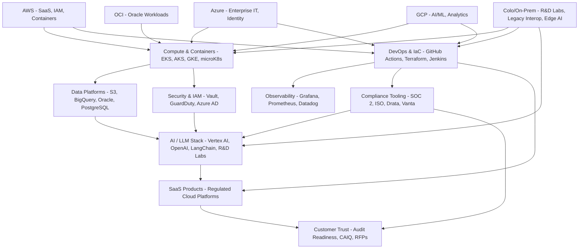

# ☁️ Athenex Cloud & Tech Stack – Architecture Diagram (Mermaid)

This diagram illustrates the hybrid multi-cloud and on-prem ecosystem at Athenex Solutions, covering SaaS, AI, DevOps, compliance, and customer trust layers.

