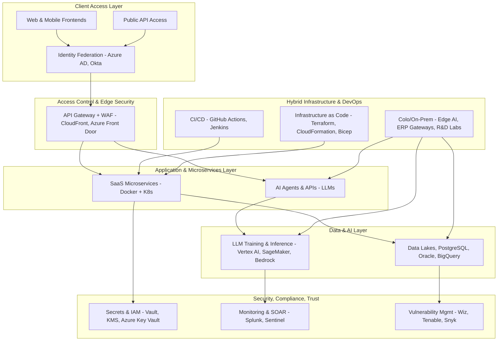

# 🏗️ Athenex Solutions – Technical Reference Architecture

This reference architecture illustrates how Athenex delivers secure, compliant, AI-powered cloud services and SaaS platforms to regulated industries using a multi-cloud, hybrid infrastructure.

---

## 1. Core Design Principles

- Cloud-First, Hybrid-Enabled: SaaS and AI workloads run primarily in the cloud; sensitive workloads handled in colocation or customer-dedicated zones.  
- Zero Trust by Default: Identity and context drive all access decisions, across cloud and on-prem.  
- Compliance-by-Design: Architecture maps directly to ISO 27001, SOC 2, FedRAMP, HIPAA, GDPR, and NIS2/DORA.  
- Modular & Scalable: Services are containerized and orchestrated via Kubernetes (EKS, AKS, GKE).  
- AI-Ready: Purpose-built compute zones for training, fine-tuning, and serving LLMs/agents.  
- Global Trust: Architected to meet data sovereignty, regional compliance, and customer assurance requirements.

---

## 2. Architecture Layers

---

## 3. Platform Distribution

| Environment             | Used For                                      | Hosted In                          |
|-------------------------|-----------------------------------------------|------------------------------------|
| SaaS Production Zones   | Regulated multi-tenant workloads              | AWS, Azure                         |
| AI/LLM Training & Serving| LLM development and inference                 | GCP (Vertex AI), Azure OpenAI      |
| Compliance Sandbox      | Certification scoping, policy testing         | Azure, GCP                         |
| Edge Inference Nodes    | Low-latency AI operations                     | On-prem (Colo / microK8s)          |
| Legacy Interop          | Financial/ERP systems integration             | OCI, Colo                          |
| Air-Gapped AI R&D       | Risk and safety testing for sensitive models  | Internal Colo Lab                  |
| Disaster Recovery       | BCDR for critical services                    | Multi-region, Colo fallback        |

---

## 4. Security & Compliance Coverage

| Domain             | Technology / Approach                               |
|--------------------|------------------------------------------------------|
| Identity & Access  | Azure AD, Okta, AWS IAM, GCP IAM, Conditional Access |
| Secrets Management | HashiCorp Vault, Azure Key Vault, AWS Secrets Mgr   |
| Monitoring         | Splunk, Azure Sentinel, GuardDuty, GCP SCC           |
| DevSecOps          | GitHub Actions, Terraform, Snyk, Prisma Cloud        |
| Data Privacy       | GDPR, CCPA/CPRA, HIPAA, ISO 27701                    |
| Control Frameworks | ISO 27001, SOC 2, PCI DSS, FedRAMP, NIST 800-53      |
| GRC Automation     | Drata, Vanta, AuditBoard, internal dashboards        |

---

## 5. Strategic Benefits

- Meets stringent regulatory demands across 40+ jurisdictions  
- Enables customer trust through verifiable controls and certifications  
- Supports cutting-edge LLMs and AI applications with layered defense  
- Offers hybrid flexibility without sacrificing security or observability  
- Built to evolve with frameworks like ISO 42001, NIS2, and DORA  

---

**Next Steps:**  
Pair this document with:
- `cloud-tech-stack.md`
- `cloud-tech-diagram.md`
- `cloud-governance-policy.md` *(optional)*
- `trust-assurance-readiness.md` *(optional)*

To fully showcase your architecture-as-leadership capability.
