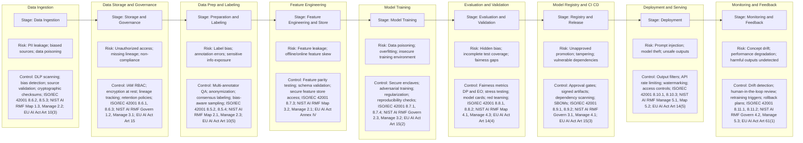

```mermaid
flowchart LR
  subgraph "Data Ingestion"
    DI["Stage: Data Ingestion"]
    R1["Risk: PII leakage; biased sources; data poisoning"]
    C1["Control: DLP scanning; bias detection; source validation; cryptographic checksums; ISO/IEC 42001 8.6.2, 8.5.3; NIST AI RMF Map 1.3, Manage 2.2; EU AI Act Art 10(3)"]
  end

  subgraph "Data Storage and Governance"
    DG["Stage: Storage and Governance"]
    R2["Risk: Unauthorized access; missing lineage; non-compliance"]
    C2["Control: IAM RBAC; encryption at rest; lineage tracking; retention policies; ISO/IEC 42001 8.6.1, 8.6.3; NIST AI RMF Govern 1.2, Manage 3.1; EU AI Act Art 15"]
  end

  subgraph "Data Prep and Labeling"
    DP["Stage: Preparation and Labeling"]
    R3["Risk: Label bias; annotation errors; sensitive info exposure"]
    C3["Control: Multi-annotator QA; anonymization; consensus labeling; bias-aware sampling; ISO/IEC 42001 8.5.2, 8.5.4; NIST AI RMF Map 2.1, Manage 2.3; EU AI Act Art 10(5)"]
  end

  subgraph "Feature Engineering"
    FE["Stage: Feature Engineering and Store"]
    R4["Risk: Feature leakage; offline/online feature skew"]
    C4["Control: Feature parity testing; schema validation; secure feature store access; ISO/IEC 42001 8.7.3; NIST AI RMF Map 3.2, Manage 2.1; EU AI Act Annex IV"]
  end

  subgraph "Model Training"
    MT["Stage: Model Training"]
    R5["Risk: Data poisoning; overfitting; insecure training environment"]
    C5["Control: Secure enclaves; adversarial training; regularization; reproducibility checks; ISO/IEC 42001 8.7.1, 8.7.4; NIST AI RMF Govern 2.3, Manage 3.2; EU AI Act Art 15(2)"]
  end

  subgraph "Evaluation and Validation"
    EV["Stage: Evaluation and Validation"]
    R6["Risk: Hidden bias; incomplete test coverage; fairness gaps"]
    C6["Control: Fairness metrics DP and EO; stress testing; model cards; red teaming; ISO/IEC 42001 8.8.1, 8.8.2; NIST AI RMF Map 4.1, Manage 4.3; EU AI Act Art 14(4)"]
  end

  subgraph "Model Registry and CI CD"
    MR["Stage: Registry and Release"]
    R7["Risk: Unapproved promotion; tampering; vulnerable dependencies"]
    C7["Control: Approval gates; signed artifacts; dependency scanning; SBOMs; ISO/IEC 42001 8.9.1, 8.9.2; NIST AI RMF Govern 3.1, Manage 4.1; EU AI Act Art 15(3)"]
  end

  subgraph "Deployment and Serving"
    DS["Stage: Deployment"]
    R8["Risk: Prompt injection; model theft; unsafe outputs"]
    C8["Control: Output filters; API rate limiting; watermarking; access controls; ISO/IEC 42001 8.10.1, 8.10.3; NIST AI RMF Manage 5.1, Map 5.2; EU AI Act Art 14(5)"]
  end

  subgraph "Monitoring and Feedback"
    MF["Stage: Monitoring and Feedback"]
    R9["Risk: Concept drift; performance degradation; harmful outputs undetected"]
    C9["Control: Drift detection; human-in-the-loop review; retraining triggers; rollback plans; ISO/IEC 42001 8.11.1, 8.11.2; NIST AI RMF Govern 4.2, Manage 5.3; EU AI Act Art 61(1)"]
  end

  DI --> DG --> DP --> FE --> MT --> EV --> MR --> DS --> MF
```
